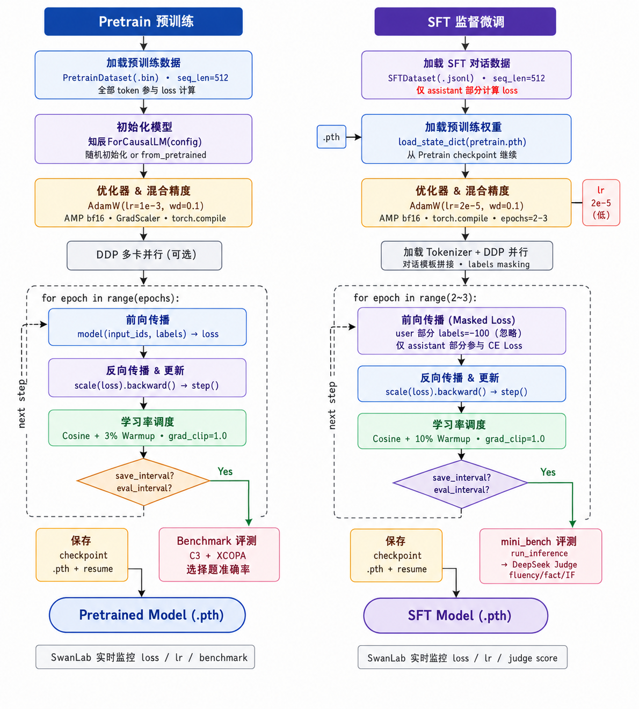
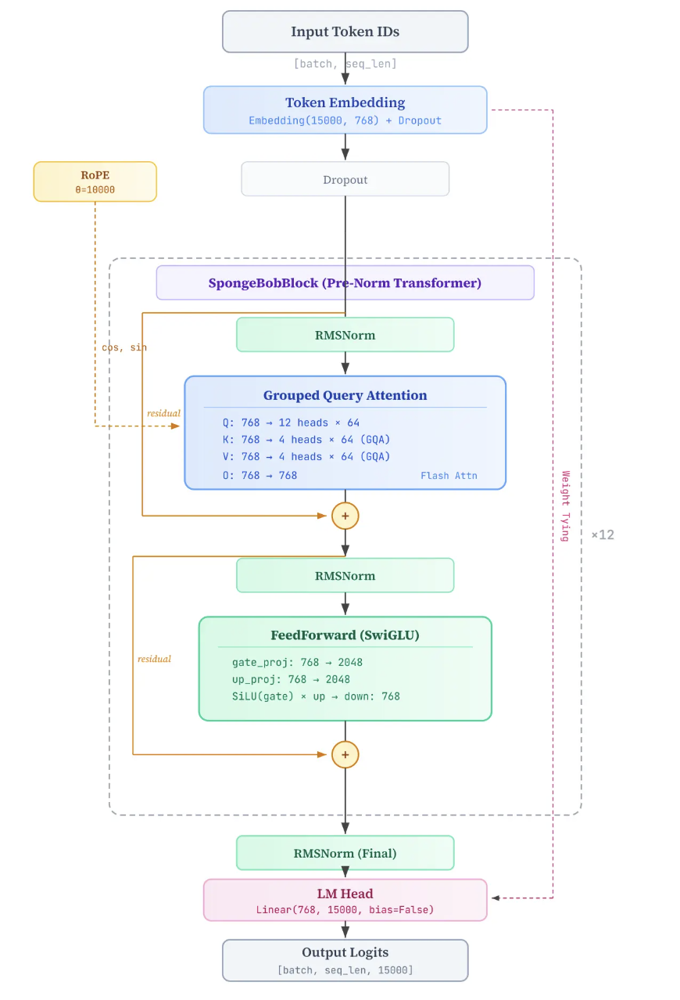
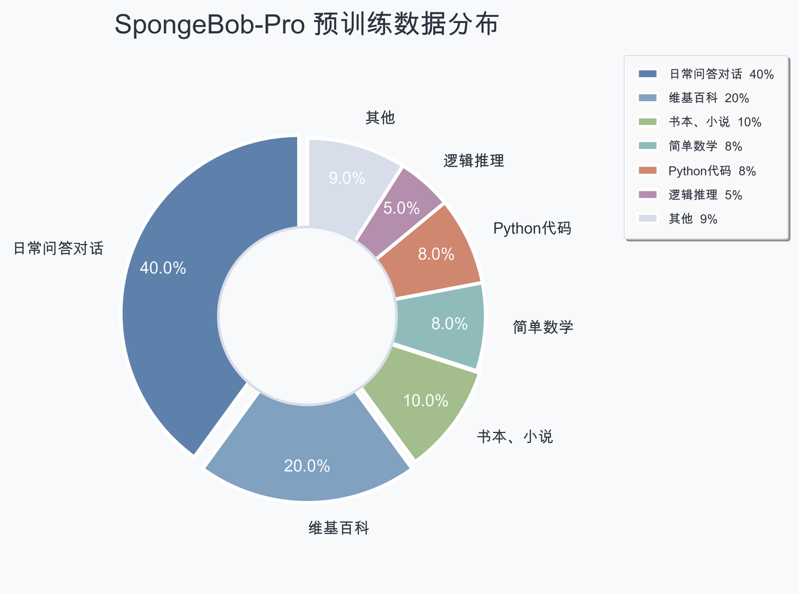
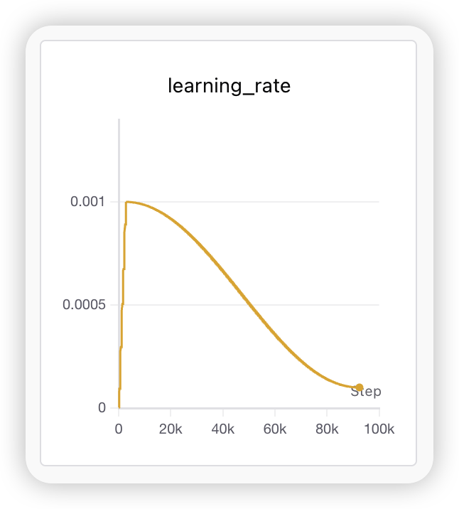
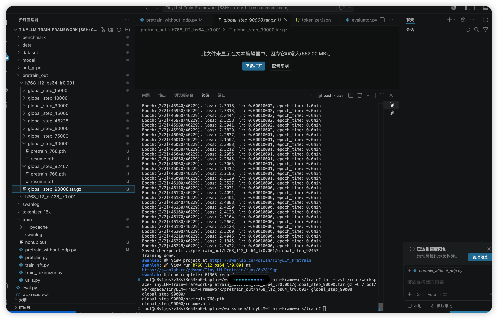
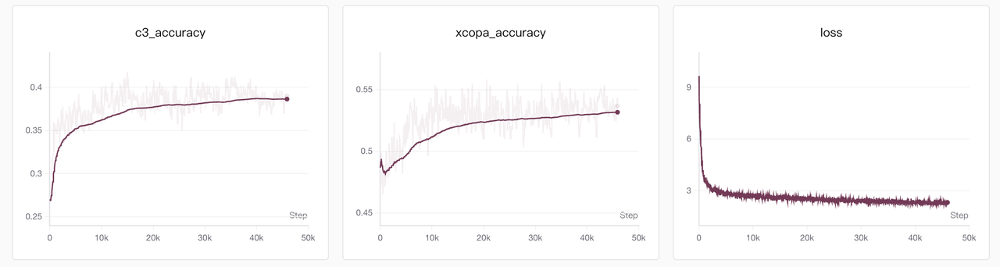
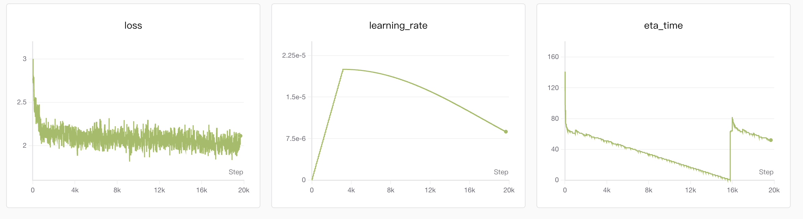
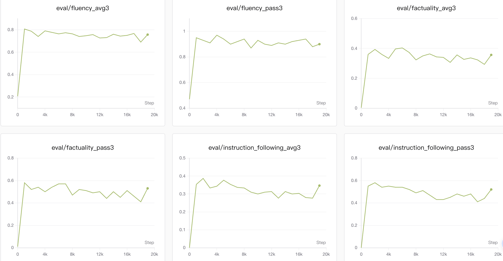
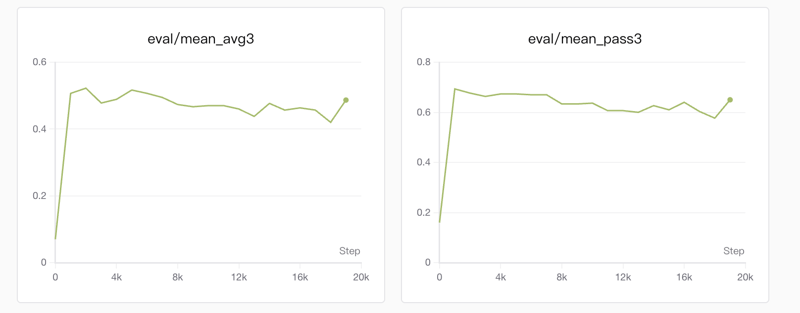
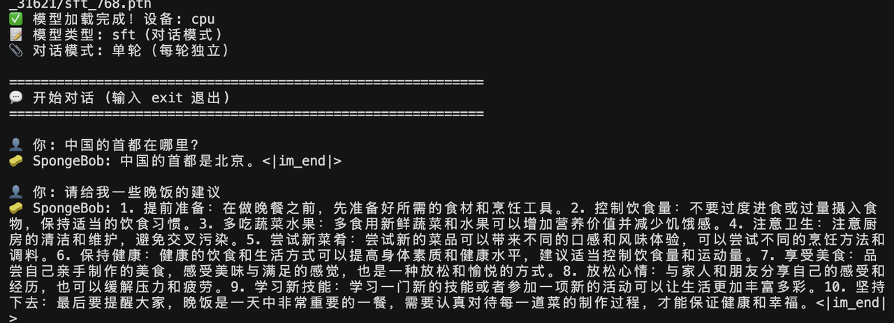

# 知辰大模型训练框架 ✨

> 从零构建 0.1B 参数级中文语言模型训练框架，覆盖 Tokenizer 构建、Decoder-only Transformer 建模、分布式预训练、监督微调、Benchmark 评测与对话验证全流程。

知辰是一个面向中文语言建模与指令跟随能力训练的轻量级大模型项目。项目不依赖现成大模型结构封装，而是从 Tokenizer、模型结构、训练循环、学习率调度、loss 计算、SFT 掩码、分布式训练到评测流程进行完整手写实现，形成一条可复现、可解释、可扩展的中文大模型训练链路。

“知辰”之名取意于：**洞悉星辰轨迹，通晓时序轮回。**“辰”指代天地时序，象征模型不仅学习语言表层规律，也尝试在连续上下文中把握因果、节奏与趋势，具备面向复杂任务的远见格局，预判万物走向。

## 项目概览 🚀

知辰的目标是从零训练一个约 0.1B 参数规模的中文语言模型，使其具备基础中文语言建模、多轮对话和指令跟随能力。完整链路如下：

```text
原始语料
  -> Byte-level BPE Tokenizer 训练
  -> 数据清洗与 token 化
  -> 预训练二进制样本构建
  -> Decoder-only Transformer 预训练
  -> 中文 Benchmark 评测
  -> SFT 指令微调
  -> 多轮对话验证
```



核心特性：

- 🧩 从零训练 15K 词表 BBPE（Byte-level BPE）Tokenizer，统一支撑预训练、SFT 和推理。
- 🧠 手写类 Qwen3 Dense 的 Decoder-only Transformer，默认配置约 82M 参数，属于 0.1B 参数级中文模型。
- ⚙️ 实现 RMSNorm、Grouped Query Attention、RoPE、SwiGLU、KV Cache、Embedding/LM Head 权重绑定等现代 LLM 关键结构。
- 📉 手写 token 级自回归交叉熵 loss、梯度累积、混合精度、Warmup + Cosine 学习率调度与 checkpoint 保存。
- 🖥️ 支持多卡 DDP 预训练和 SFT，SwanLab 记录 loss、学习率和训练过程。
- 🎯 SFT 阶段仅对 assistant 回答区域计算 loss，指令和用户输入部分通过 `label=-100` 屏蔽。
- 📊 使用中文因果推断/逻辑推理 Benchmark 进行能力验证，包括 XCOPA 与 CLUE C3。

## 整体架构 🏗️



知辰采用标准 Decoder-only Transformer 架构。每个 Transformer Block 使用 Pre-Norm 结构：

```text
x = x + SelfAttention(RMSNorm(x))
x = x + SwiGLU(RMSNorm(x))
```

默认模型配置如下：

| 配置项 | 默认值 | 说明 |
| --- | ---: | --- |
| `vocab_size` | 15000 | 15K Byte-level BPE 词表 |
| `hidden_size` | 768 | 隐藏层维度，需能被 Query 头数整除 |
| `num_hidden_layers` | 12 | Transformer Block 层数 |
| `num_attention_heads` | 12 | Query 头数 |
| `num_key_value_heads` | 4 | Key/Value 头数，GQA 分组比为 3:1 |
| `intermediate_size` | 2048 | SwiGLU 前馈网络中间维度 |
| `max_seq_len` | 512 | 训练默认序列长度 |
| `max_position_embeddings` | 32768 | RoPE 位置编码最大配置能力 |
| `rope_theta` | 10000.0 | RoPE 基础频率 |
| `dropout` | 0.0 | 默认不使用 dropout |
| 参数规模 | 约 82M | 默认配置下的近似参数量 |

### RMSNorm：更稳定的 Pre-Norm 归一化

项目使用 RMSNorm 替代 LayerNorm。RMSNorm 只按均方根进行缩放，不做均值中心化，计算时先转为 `float32`，再转回原始精度，以降低混合精度训练中的数值误差。

与 Post-Norm 相比，Pre-Norm 将归一化放在 Attention 和 FFN 之前，残差路径更直接，深层训练更稳定：

```python
hidden_states = hidden_states + Attention(RMSNorm(hidden_states))
hidden_states = hidden_states + MLP(RMSNorm(hidden_states))
```

### GQA 分组查询注意力：降低 KV 参数与推理缓存

知辰默认使用 12 个 Query 头、4 个 Key/Value 头。Key/Value 头数只有 Query 的三分之一，前向传播时通过 `repeat_kv` 动态扩展 KV，使其匹配 Query 头数。

这种 Grouped Query Attention 设计保留多头 Query 的表达能力，同时减少 K/V 投影参数量，并显著降低推理阶段 KV Cache 的显存占用。默认配置下分组比为：

```text
num_attention_heads / num_key_value_heads = 12 / 4 = 3
```

### RoPE 旋转位置编码：无参数注入相对位置信息

项目手写 RoPE 旋转位置编码，将每个注意力头的 hidden 维度按两两一组视为复平面上的旋转分量。模型预先计算不同位置的 `cos/sin` 频率表，前向时对 Q/K 施加旋转变换，使注意力分数天然感知相对位置差。

RoPE 不引入额外可训练参数，适合 Decoder-only 自回归语言模型，也便于在推理时结合 KV Cache 增量生成。

### SwiGLU 前馈层：门控信息流

知辰使用 SwiGLU 替代传统 ReLU FFN。前馈层包含两条并行线性分支：

```text
down_proj(silu(gate_proj(x)) * up_proj(x))
```

其中 `gate_proj` 控制每个维度的信息流，`up_proj` 提供候选特征，二者逐元素相乘后再投影回隐藏维度。相比普通 ReLU FFN，SwiGLU 的梯度更平滑，表达能力更强，是现代 LLM 中常用的前馈结构。

### KV Cache 与权重绑定

推理时，模型支持 `past_key_values`。新 token 只需要和历史 KV 拼接，不必重复计算完整前缀，从而降低自回归生成的重复计算成本。

同时，项目将输入 Embedding 与输出 LM Head 权重绑定：

```python
embed_tokens.weight = lm_head.weight
```

在 15K 词表、768 hidden size 下，权重绑定可减少约 `15000 x 768 = 11.5M` 参数，使小参数模型更紧凑。

## Tokenizer 构建 🧩

Tokenizer 是知辰训练链路的第一步。项目从中文和英文语料中训练 BBPE（Byte-level BPE）Tokenizer，词表大小为 15K，其中包含 15 个特殊 token。

特殊 token 设计如下：

| Token | 用途 |
| --- | --- |
| `<|endoftext|>` | 文本结束、padding/unknown 兜底 |
| `<|im_start|>` / `<|im_end|>` | 对话边界控制 |
| `<|system|>` / `<|user|>` / `<|assistant|>` | 对话角色标识 |
| `<think>` / `</think>` | CoT 推理片段标识 |
| `<tool_call>` / `</tool_call>` | 工具调用边界 |
| `<function>` / `</function>` | 函数调用边界 |
| `<pad>` / `<unk>` / `<unused_0>` | 填充、未知和保留位 |

训练入口：

```bash
python train/train_tokenizer.py
```

输出目录：

```text
tokenizer_15k/
  tokenizer.json
  tokenizer_config.json
  vocab.json
  merges.txt
```

该 Tokenizer 在预训练、SFT 和推理阶段保持统一，避免不同阶段编码空间不一致带来的分布偏移。

## 预训练流程 🔥

预训练阶段使用约 1.5B tokens 多源开源语料。数据预处理后保存为 `.bin + .meta` 格式，训练时通过 `numpy.memmap` 读取，避免一次性加载大规模 token 数据到内存。



预训练数据集返回 `(input_ids, labels)`，二者初始相同。模型内部执行 shift：

```text
shift_logits = logits[..., :-1, :]
shift_labels = labels[..., 1:]
loss = CrossEntropy(shift_logits, shift_labels)
```

也就是使用当前位置之前的上下文预测下一个 token，符合标准自回归语言模型训练目标。

单机多卡预训练示例：

```bash
torchrun --nproc_per_node=4 train/pretrain.py \
  --data_path /path/to/pretrain_data \
  --save_dir ./pretrain_out \
  --hidden_size 768 \
  --num_hidden_layers 12 \
  --batch_size 128 \
  --accumulation_steps 4 \
  --learning_rate 1e-3 \
  --dtype bfloat16 \
  --use_compile 1 \
  --max_seq_len 512 \
  --use_swanlab 1
```

训练代码包含：

- DDP 分布式初始化和 `DistributedSampler` 数据切分。
- `torch.amp.autocast` 引入 bfloat16 混合精度训练。
- `torch.compile` 对模型前向进行动静态图编译优化，减少 Python 调度开销。
- 梯度累积、梯度裁剪与 AdamW 参数更新，突破单卡显存对 batch size 的限制。
- AdamW 优化器与 Warmup + Cosine Decay 学习率调度。
- 主进程 checkpoint 保存，支持后续 resume。
- 周期性运行中文 Benchmark，并将结果记录到 SwanLab。

### 训练工程优化：AMP、torch.compile 与梯度累积

在硬件显存有限的情况下，知辰没有简单降低模型结构复杂度，而是从训练工程侧进行优化，尽量在稳定性、吞吐和显存之间取得平衡。



| 优化项 | 实现方式 | 作用 |
| --- | --- | --- |
| bfloat16 AMP | `torch.amp.autocast(device_type="cuda", dtype=torch.bfloat16)` | 降低激活显存占用，提高 Tensor Core 计算吞吐，同时保留比 fp16 更大的指数范围 |
| torch.compile | `model = torch.compile(model)` | 对前向图进行编译优化，减少 Python 解释器调度和小算子开销 |
| 梯度累积 | `loss / accumulation_steps` 后分步反传 | 在显存不足以容纳大 batch 时，用多次 micro-batch 近似更大的全局 batch |
| 梯度裁剪 | `clip_grad_norm_` | 降低训练早期或异常 batch 带来的梯度爆炸风险 |
| Warmup + Cosine | `get_lr(current_step, total_steps, lr, warmup_steps)` | 训练初期平滑升温，后期余弦衰减，兼顾收敛速度与稳定性 |

其中，bfloat16 AMP 是本项目训练稳定性的重要选择。相比 fp16，bfloat16 拥有更大的动态范围，在大模型训练中更不容易出现溢出；相比 fp32，则能明显降低显存占用并提升计算效率。代码中通过 `--dtype bfloat16` 控制混合精度上下文，默认在 CUDA 环境下启用 `autocast`。

梯度累积用于解决“模型、序列长度和 batch size 同时增大时显存不足”的问题。每个 micro-batch 先计算 `loss / accumulation_steps` 并反向传播，累计多步梯度后再统一执行一次 optimizer step。这样可以在不改变模型结构的情况下扩大等效 batch size，使训练曲线更平滑。

训练过程中会定期保存 checkpoint，并记录 loss、learning rate、global step 等信息，保证长时间训练出现中断时可以继续恢复。



## SFT 指令微调 🎯

SFT 阶段使用 2M+ 条指令微调数据，将预训练模型继续训练为具备中文多轮对话与指令跟随能力的模型。

SFT 数据格式为多轮对话：

```json
{
  "conversations": [
    {"role": "user", "content": "请解释什么是注意力机制。"},
    {"role": "assistant", "content": "注意力机制是一种..."}
  ]
}
```

项目将对话编码为：

```text
<|im_start|><|user|>用户问题<|im_end|><|assistant|>模型回答<|im_end|>
```

其中 user 指令部分全部设置为 `label=-100`，只对 assistant 回答部分计算交叉熵：

```text
input_ids: <|user|> question <|im_end|> <|assistant|> answer <|im_end|>
labels:    -100     -100     -100       assistant_tokens...
```

这样模型不会被训练去复读用户问题，而是专注学习在给定指令后的回答分布。

SFT 训练示例：

```bash
torchrun --nproc_per_node=4 train/train_sft.py \
  --data_path /path/to/sft_data.jsonl \
  --tokenizer_path ./tokenizer_15k \
  --from_weight /path/to/pretrain_768.pth \
  --save_dir ./out_sft \
  --hidden_size 768 \
  --num_hidden_layers 12 \
  --batch_size 128 \
  --accumulation_steps 4 \
  --learning_rate 2e-5 \
  --dtype bfloat16 \
  --use_compile 1 \
  --max_seq_len 512 \
  --use_swanlab 1
```

如果启用 SFT 阶段生成式评估，可通过命令参数传入 Judge 模型配置。README 中不写入任何 API Key，实际使用时建议通过环境变量或本地安全配置传入密钥。

## 评测与实验结果 📊

项目在预训练和 SFT 阶段均设计了评测闭环：

- 预训练阶段：使用中文因果推断/逻辑推理 Benchmark 评估模型基础理解能力。
- SFT 阶段：使用自建 `benchmark/mini_bench` 抽样生成回答，并结合 DeepSeek Judge 进行对话质量评估。
- 训练过程：使用 SwanLab 记录 loss、learning rate、ETA 和评测指标，便于观察收敛趋势。

因此，SFT 训练曲线、三维 Judge 指标、综合 mean/pass 指标并不是单独的过程截图，而是知辰评测体系的一部分：它们分别对应“训练状态是否收敛”“回答质量各维度是否达标”“采样生成下可用回答概率是否提升”。



### SFT Benchmark：自建指令评测与 LLM-as-Judge

为了更直接观察 SFT 后模型的基础对话能力，项目额外构建了一个轻量级自建 SFT Benchmark。该 Benchmark 不追求覆盖所有复杂知识场景，而是聚焦小模型最基础、最容易暴露问题的交互能力：回答是否自然、是否符合事实、是否真正理解并执行了用户指令。

评测数据通过 LLM 对预定义的 9 种类别进行 prompt 生成，共 100 条样本：

| 类别 | 样本数 | 评估重点 |
| --- | ---: | --- |
| 开放问答 | 30 | 日常对话、常见问题回答 |
| 基础常识 | 29 | 基础事实与生活常识 |
| 简单指令 | 10 | 是否按用户要求执行 |
| 简单逻辑 | 10 | 基础推理与条件判断 |
| 上下文提取 | 5 | 从给定上下文中提取关键信息 |
| 角色扮演 | 5 | 是否保持设定角色与语气 |
| 简单的代码 | 5 | 基础代码理解与生成 |
| 算术与数字 | 5 | 简单数字计算与比较 |
| 结束语 | 1 | 对话结束场景 |

评估方式采用 **LLM-as-Judge**：每个 prompt 生成 3 个候选回答，再使用 DeepSeek V3.2 快思考版本作为 Judge，从三个维度进行二值判分。

| 维度 | 含义 |
| --- | --- |
| `fluency` | 回答是否流畅、语言是否自然 |
| `factuality` | 回答是否准确、是否符合事实 |
| `instruction_following` | 是否正确理解并遵循指令，回答用户真正提出的问题 |

Judge Prompt 如下：

```text
请根据问题对以下回答进行评分（0-1 二值）：

【问题】{question}
【回答】{response}

请从三个维度评分（0=不通过，1=通过）：
1. fluency: 回答是否流畅、语言自然
2. factuality: 回答是否准确、符合事实
3. instruction_following: 是否正确理解并遵循了指令并回答用户问题

请务必严格，如果无法判断，则视为不通过。

以 JSON 格式输出：
{
  "fluency": 0 或 1,
  "factuality": 0 或 1,
  "instruction_following": 0 或 1
}
```

SFT 阶段训练曲线如下，可以看到 loss 在微调早期快速下降，并在后续阶段进入相对稳定区间；learning rate 使用 warmup 后余弦衰减，ETA 曲线反映了长时间训练过程中的耗时变化。



三维 Judge 指标用于分别观察模型回答的语言自然度、事实正确性和指令遵循能力：



最终综合指标通过 `mean_avg3` 和 `mean_pass3` 汇总，其中 `avg3` 表示 3 个候选回答的平均通过率，`pass3` 表示 3 个候选回答中至少有 1 个通过的比例，更适合观察小模型在采样生成场景下的可用回答概率。



核心实验结果：

| 指标 | 结果 |
| --- | ---: |
| 预训练数据规模 | 约 1.5B tokens |
| SFT 数据规模 | 2M+ 条 |
| 训练 loss | 约 8 收敛至约 2.3 |
| XCOPA 中文因果推断 Benchmark | 约 0.55 |
| CLUE C3 中文阅读理解/逻辑推理 Benchmark | 约 0.48 |

经过 SFT 后，知辰能够进行中文多轮对话，并对常见指令给出结构化回答。



评测相关入口：

```bash
python eval.py
python benchmark/test_xcopa_improved.py
python benchmark/mini_bench/eval.py
```

## 项目结构 🗂️

```text
.
├── model/
│   ├── config.py                 # 模型配置：hidden size、层数、头数、词表等
│   └── model_spongebob_pro.py    # Decoder-only Transformer 主体实现
├── train/
│   ├── train_tokenizer.py        # 15K Byte-level BPE Tokenizer 训练与验证
│   ├── pretrain.py               # 支持 DDP 的预训练脚本
│   ├── pretrain_without_ddp.py   # 单进程预训练脚本
│   ├── train_sft.py              # SFT 指令微调脚本
│   └── utils.py                  # 学习率调度、DDP 初始化、日志工具
├── dataset/
│   ├── preprocess_data.py        # 预训练数据预处理
│   ├── pretrain_dataset.py       # memmap 预训练数据集
│   └── sft_dataset.py            # assistant-only loss 的 SFT 数据集
├── benchmark/
│   ├── evaluator.py              # Benchmark 评测工具
│   ├── test_xcopa_improved.py    # XCOPA 中文因果推断评测
│   └── mini_bench/               # SFT 生成式评测样例
├── tokenizer_15k/                # 已训练 Tokenizer 文件
└── assets/README/                # README 展示图片
```

## 快速开始 ⚡

### 1. 准备环境

建议使用 Python 3.10+ 和 PyTorch 2.x。根据机器 CUDA 版本安装对应 PyTorch 后，再安装项目所需依赖，例如：

```bash
pip install torch transformers tokenizers datasets swanlab
```

### 2. 验证 Tokenizer

```bash
python train/train_tokenizer.py
```

该脚本当前默认执行 Tokenizer 验证逻辑，会加载 `tokenizer_15k/` 并打印词表大小、编码解码一致性和对话模板。

### 3. 启动预训练

```bash
torchrun --nproc_per_node=4 train/pretrain.py \
  --data_path /path/to/pretrain_data \
  --save_dir ./pretrain_out \
  --hidden_size 768 \
  --num_hidden_layers 12 \
  --batch_size 128 \
  --learning_rate 1e-3
```

### 4. 启动 SFT

```bash
torchrun --nproc_per_node=4 train/train_sft.py \
  --data_path /path/to/sft_data.jsonl \
  --tokenizer_path ./tokenizer_15k \
  --from_weight /path/to/pretrain_768.pth \
  --save_dir ./out_sft \
  --learning_rate 2e-5
```

### 5. 运行评测

```bash
python eval.py
python benchmark/test_xcopa_improved.py
```

## 工程亮点 🌟

- ✅ **从零实现链路完整**：Tokenizer、模型、训练循环、loss、调度器、SFT 掩码和评测均在项目内实现。
- ✅ **结构贴近现代 LLM**：RMSNorm、RoPE、GQA、SwiGLU、KV Cache 和权重绑定均为当前主流 Decoder-only LLM 的关键设计。
- ✅ **训练工程闭环**：支持 DDP、多卡训练、混合精度、checkpoint、SwanLab 追踪和 Benchmark 回传。
- ✅ **中文任务导向**：Tokenizer、预训练语料、SFT 数据和评测任务均围绕中文语言能力构建。
- ✅ **小规模可验证**：约 0.1B 参数规模便于在有限算力下完成端到端实验，同时保留大模型训练框架的核心复杂度。

## 总结 🧭

知辰并不是简单调用现成大模型接口的应用项目，而是一个从底层组件到训练闭环完整搭建的中文大模型训练框架。项目以 15K BBPE Tokenizer 为统一编码基础，手写类 Qwen3 Dense 的 Decoder-only Transformer，并通过多卡预训练和 SFT 指令微调，让约 0.1B 参数级模型获得基础中文理解、因果推断、逻辑推理和多轮对话能力。

该项目的价值在于：通过可读、可改、可训练的代码，把大模型训练中的核心机制拆解为可以验证的工程模块，完整展示从数据到模型、从训练到评测、从 loss 收敛到对话效果的端到端能力。
